> **Status: working draft (bullet form).** Numbers are final and trace to
> `output/results_digest.json`; prose to be expanded at submission. Figures
> embedded inline.

# Abstract (draft points)

- LLPS predictors are trained almost entirely on **soluble** proteins but are
  increasingly applied to **membrane** proteins, whose TM segments and
  constrained cytoplasmic domains violate their assumptions.
- We benchmarked **18 predictors** against **60 human membrane proteins** with
  curated experimental LLPS evidence, scoring against a **same-class
  (membrane-vs-membrane) background** to remove the trivial soluble-vs-membrane
  signal.
- **Structure-aware models led**: PSPHunter AUROC 0.80 (0.90 leakage-corrected);
  PSPire and PdPS ≈ 0.81. **LLPhyScore**, tuned on soluble IDRs, was at
  **chance (0.49)**, even sign-flipped.
- **Topology-resolved scoring**: 7/8 position-aware tools score cytoplasmic
  regions > TM segments (all FDR < 0.05); **SEG** (low-complexity masker) is
  the lone reversal.
- **Cross-predictor consensus tracks the soluble-IDR signature, not curated
  LLPS mechanism**: it is dominated by **hydrophobicity** (ρ = −0.69, strongest
  correlate), rises with **chain length** (ρ = +0.56) and **disorder**
  (ρ = +0.33), and falls with **TMD count** (ρ = −0.41). Large single-pass
  receptors/RTKs with big disordered tails (EGFR, ERBB2, JPH2, CKAP4) rank
  **high**; compact, hydrophobic multi-pass transporters/channels and small
  tail-anchored proteins (MALL, NPY2R, MFSD1) — several with genuine LLPS
  evidence — are systematically **under-ranked**.
- Delineates a **membrane-protein-specific failure mode** — predictors reward
  the generic disorder/length signature and penalise membrane-embedded
  architecture irrespective of experimental mechanism; argues for
  topology-aware training and evaluation.

# Introduction (draft points)

- LLPS organises the cell into membraneless compartments; curated databases
  [@phasepdb2020; @llpsdb2020; @drllps2020; @phasepro2020; @cdcode2023] have
  enabled many sequence- and structure-based predictors.
- Predictor families span: prion-like / low-complexity composition
  [@plaac2014; @seg1993]; π–π and cation–π interaction models [@vernon2018];
  disorder proxies [@espritz2012; @iupred2a2018]; physicochemical scores
  [@catgranule2016]; deep sequence models [@deephase2021]; and ML classifiers
  using AlphaFold features [@alphafold2021; @picnic2024; @pspire2024;
  @psphunter2024; @psap2021; @phasepred2022; @pdl2025].
- **Problem**: almost all trained/validated on soluble proteins. Membrane
  proteins (~25% of the proteome, majority of drug targets) are largely absent
  from training corpora yet routinely scored.
- Membrane proteins break predictor assumptions three ways:
    - TM segments are hydrophobic α-helices whose composition mimics the
      low-complexity regions some tools flag as LLPS-prone;
    - extra-membrane domains are split into cytoplasmic vs extracellular/lumenal
      faces with very different physicochemistry;
    - documented membrane LLPS (TCR/LAT clustering, Wnt signalosome,
      nephrin/NCK/N-WASP) is driven by **cytoplasmic tails**, not the
      membrane-embedded core.
- **This study** — 18 predictors × 60 curated membrane LLPS proteins, with three
  membrane-specific design choices:
    1. same-class (membrane-vs-membrane) background;
    2. protein-by-protein training-set **leakage audit** + leakage-corrected AUROC;
    3. **topology-resolved** scoring (cytoplasmic / TM / extracellular-lumenal).

# Results

## 1. Structure-aware models lead; a soluble-tuned biophysical model fails

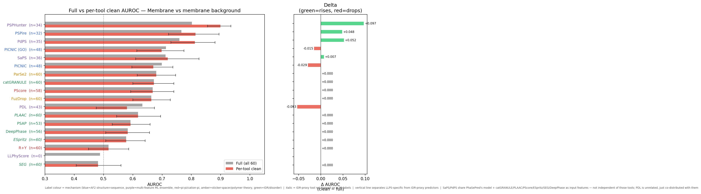

- Set: 60 human membrane proteins with curated LLPS evidence (56 PhaSepDB, rest
  LLPSDB); each scored by 18 predictors; discrimination = AUROC vs a background
  of other human membrane proteins.
- **Top tier (structure-aware, AlphaFold features)**: PSPHunter **0.80**, PSPire
  **0.77**, PdPS **0.76** [@psphunter2024; @pspire2024; @phasepred2022].
- **Middle tier**: PICNIC variants + SaPS, AUROC ≈ 0.70–0.71 [@picnic2024].
- **Compositional / disorder proxies** near 0.6: PLAAC 0.62, PSAP 0.59,
  DeePhase 0.58, ESpritz 0.58.
- **At/below chance**: R+Y 0.52, SEG 0.48, **LLPhyScore 0.49**. LLPhyScore is
  biophysically interpretable but tuned on soluble IDRs [@llphyscore2022];
  retains no signal on membrane proteins even sign-flipped. → clearest evidence
  that soluble-IDR inductive biases do not transfer.
- **Training-set leakage (Fig 1, right)** — substantial and *asymmetric*:
    - 25/60 positives (42%) flagged for ≥1 predictor.
    - For the leaders, leaked proteins are mostly **negatives** in the background
      (PSPHunter 22 neg vs 4 pos; PdPS 23 vs 2).
    - Removing leaked proteins therefore **raises** the leaders: PSPHunter →
      **0.90** (95% CI 0.86–0.94), PSPire → 0.81, PdPS → 0.81.
    - PDL (leaked proteins all positives) **drops** 0.63 → 0.58.
    - Leakage-corrected values used throughout.

## 2. Predictor scores follow the membrane topology

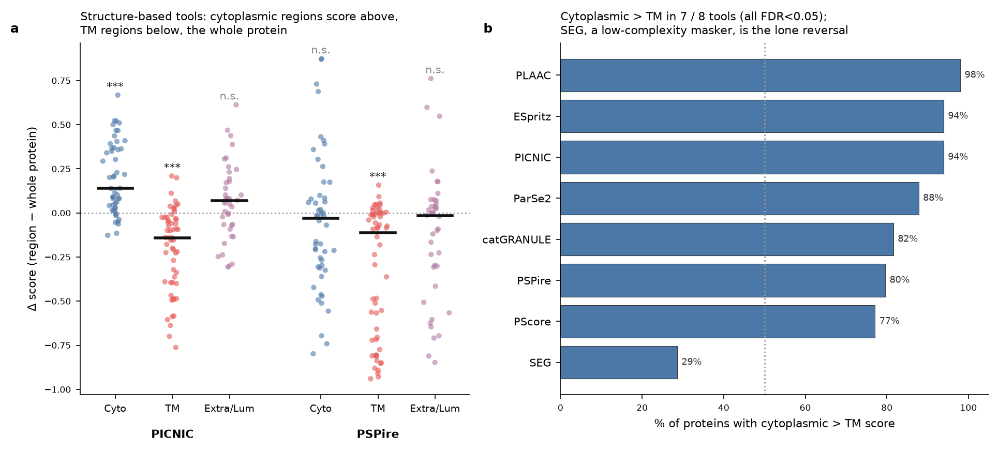

- Test: partition per-residue / per-region scores into cytoplasmic, TM, and
  extracellular/lumenal using UniProt topology; compare each region vs
  whole-protein score (paired Wilcoxon, BH-FDR).
- **Structure tools on AlphaFold models**:
    - PICNIC: cytoplasmic **above** whole (median Δ = +0.14, FDR < 10⁻⁷); TM
      **below** (Δ = −0.14, FDR < 10⁻⁷).
    - PSPire: same TM suppression (Δ = −0.11, FDR < 10⁻⁷).
- **Cytoplasmic > TM in 7/8 position-aware tools (all FDR < 0.05, Fig 2b)**:
  PLAAC 98% of proteins, ESpritz 94%, PICNIC 94%, ParSe2 88%, catGRANULE 82%,
  PSPire 80%, PScore 77%.
- Largest median cyto−TM gap: PICNIC Δ = 0.47, PSPire Δ = 0.28.
- **Lone reversal: SEG** (low-complexity masker) — TM scored *higher* (29%
  cyto > TM; median Δ = −0.17, FDR < 10⁻³), as expected for a tool that flags
  hydrophobic α-helices.
- **Read**: given topology, the tools localise their signal to the cytoplasmic
  face — consistent with membrane-condensate biology — even when the
  whole-protein score is uninformative.
- **Region-level comparison now separates the topology-class (biology)
  effect from the concatenation (methodological) effect, for all 14
  region-capable tools including the two structure-based tools** (Fig 9;
  `output/predictor_region_biology_tests.csv`,
  `output/predictor_splice_artifact_tests.csv`). PICNIC and PSPire, being
  structure/AlphaFold2-based, have no isolated-sequence mode; their
  structural analogue of sequence concatenation is a single continuous
  chain built by renumbering each region's AlphaFold-model fragments into
  one PDB (`pdb_concatenated`, retaining true 3D coordinates), compared
  against the mean of the same tool's per-fragment (`pdb_region`) scores.
    - **Topology-class effect (unspliced, per-segment scores; Fig 9a).**
      Cytoplasmic scores exceed TM in 12/13 tools with segment-level TM
      coverage (all FDR < 0.05 except DeePhase and PSAP is borderline),
      including both structure-based tools (PICNIC 94% of proteins,
      PSPire 86%); SEG is the lone reversal (29% cyto > TM, FDR < 10⁻³),
      as in Fig 2b. Cytoplasmic also exceeds extracellular/lumenal in
      8/14 tools (all in the cyto-favouring direction, none reversed).
      Transmembrane vs extracellular/lumenal is mixed and tool-dependent:
      significant in 10/13 tools, with extracellular favoured in 8 of
      those 10 (including both structure-based tools: PICNIC 9%, PSPire
      35% TM > Ecto) and only SEG and PSAP favouring TM.
    - **Slicing/splicing artifact (spliced-vs-unspliced, same region;
      Fig 9b).** Concatenating a region's fragments into one query
      changes the score relative to the mean of separately-scored
      fragments in 20/41 tool × region tests (FDR < 0.05), but the
      direction and magnitude are inconsistent across tools — this is a
      real per-tool sensitivity to context, not a systematic bias in one
      direction. The clearest structure-specific instance is the TM
      region: both PICNIC and PSPire show a strong, highly consistent
      **drop** in the concatenated-structure score relative to the
      per-fragment mean (PICNIC 0/56 proteins scored higher when
      concatenated, FDR < 10⁻³; PSPire 1/56, FDR < 10⁻³) — concatenating
      disjoint single-pass TM helices into one continuous chain removes
      information the true multi-fragment 3D arrangement carries, unlike
      the cytoplasmic and extracellular/lumenal regions where the two
      structure tools show no significant splicing effect.
    - **Read**: the topology-class effect (cytoplasmic-face signal) is
      robust to how the region is queried, is shared by sequence- and
      structure-based tools alike, and is not an artefact of
      concatenation; the concatenation artefact itself is real but
      tool- and region-specific rather than a uniform correction factor,
      and is most consequential for structure-based tools scoring
      disjoint TM fragments.

## 3. A cross-predictor consensus tracks the soluble-IDR signature, not mechanism

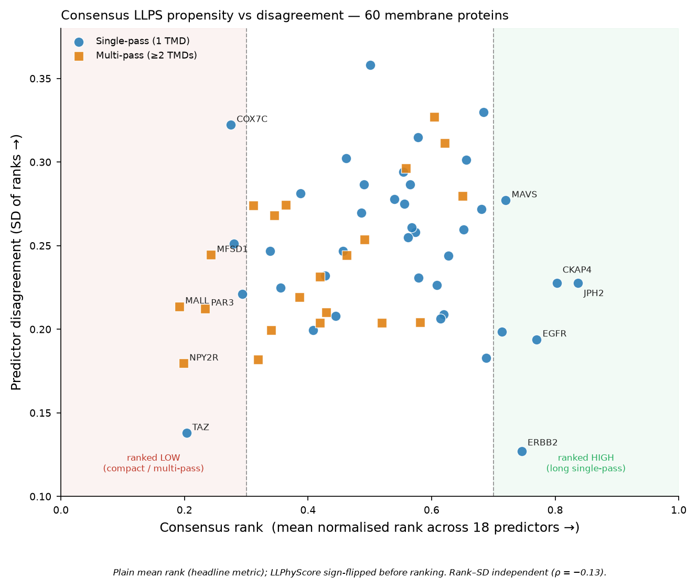

- Consensus = each tool's per-protein rank (LLPhyScore sign-flipped), averaged
  across the 18 tools; reported as **plain mean rank** (headline) with the
  AUROC-weighted mean as a supplement (the two agree, ρ = 0.996, and give the
  same top/bottom proteins). Between-predictor SD gives a disagreement score.
- **Governed by the classic soluble-IDR signature**, not membrane biology:
    - **Hydrophobicity is the single strongest correlate**: whole-protein
      Kyte–Doolittle hydropathy ρ = **−0.69** — more hydrophobic ⇒ ranked lower.
    - Chain length ρ = **+0.56** — longer ⇒ higher; holds *within* single-pass
      proteins alone.
    - Disordered fraction ρ = **+0.33**; LCR fraction and net charge also
      positive.
    - TMD count ρ = **−0.41** — more membrane passes ⇒ ranked lower.
    - Partial-correlation control confirms **hydrophobicity, length and disorder
      are independent axes** (each survives adjustment for the others), and the
      hydrophobicity effect holds *within* both topology classes — so
      "multi-pass lower" is not merely a length artifact.
- **Consistently high**: large single-pass receptors / RTKs with big disordered
  cytoplasmic tails — JPH2 (0.84), CKAP4 (0.80), EGFR (0.77), ERBB2 (0.75),
  MAVS (0.72), ALK (0.71), LRP6 (0.69), LAT (0.68), ERBB4 (0.65). These are the
  **best-documented** membrane LLPS drivers, and the tools rank them correctly.
- **Consistently low**: compact / hydrophobic proteins — MALL (4 TMD, 153 aa;
  0.19), NPY2R (7-TM GPCR; 0.20), TAZ (0.20), PAR3 (7 TMD; 0.23), MFSD1
  (12 TMD; 0.24), COX7C (63 aa; 0.28), SC6A4 (12 TMD; 0.32). Several
  (MFSD1, PAR3, the multi-pass transporters) carry genuine curated LLPS
  evidence yet fall to the bottom.
- **Why the split** (the "large exposed regions" intuition, confirmed): the
  high-ranked single-pass receptors carry long, disordered cytoplasmic tails
  that match exactly what soluble-IDR predictors learned; the low-ranked set is
  either membrane-dominated (multi-pass, hydrophobic) or too short/compact to
  register. Median length single-pass 770 aa vs multi-pass 503 aa.
- Disagreement (score SD) unrelated to rank (ρ = −0.13, p = 0.32) → both the
  high and low extremes reflect genuine tool **agreement**, not uncertainty; no
  sequence feature explains disagreement (none survive FDR).
- **Post-translational modification burden tracks the same axis**: total
  annotated UniProt PTM sites (phosphorylation, ubiquitination/SUMOylation,
  glycosylation, lipidation) correlate positively with consensus rank
  (ρ = **+0.49**, FDR-p < 0.001), and PTM sites restricted to the cytoplasmic
  region alone give the same signal (ρ = +0.44, FDR-p = 0.001). This tracks
  chain length (longer proteins accumulate more annotated sites) but is not
  fully explained by it: partial correlation controlling for length leaves
  ρ ≈ +0.29–0.33 (still FDR-significant), so PTM density carries information
  beyond a length proxy.
  Mechanistically this is consistent with the same signature as disorder and
  length — heavily modified cytoplasmic tails are also typically long and
  disordered — rather than evidence that any predictor explicitly encodes PTM
  state.

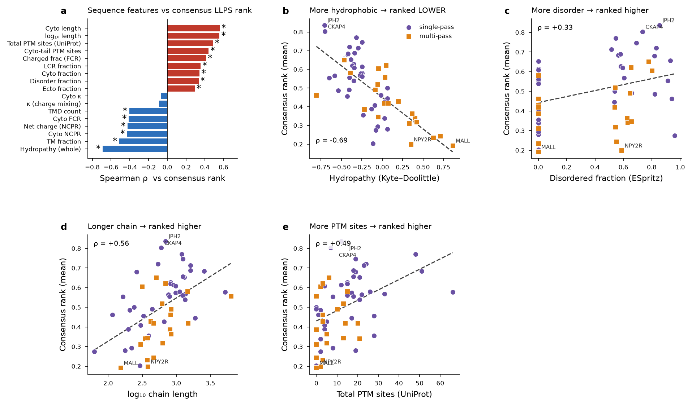

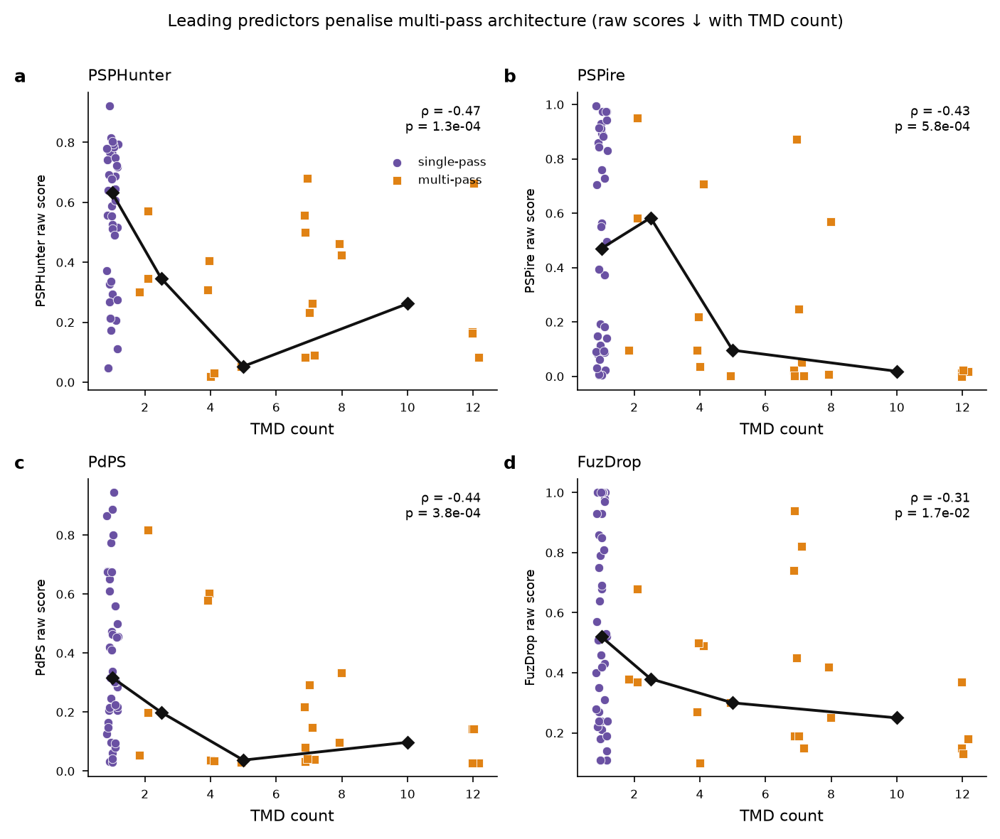

- The architecture bias is **not** an artifact of the rank-averaging step: it is
  visible in the **raw scores of the individual leading tools**. Across the 60
  proteins, raw score falls monotonically with TMD count for every leader —
  PSPHunter ρ = −0.47, PdPS ρ = −0.44, PSPire ρ = −0.43, FuzDrop ρ = −0.31
  (all p < 0.02) — mirroring the pattern FuzDrop's authors reported for
  multi-pass proteins. Single-pass proteins occupy the high-score band; scores
  collapse as soon as ≥2 TM helices are present.

## 4. Consensus and discordance: which proteins do predictors agree on, and why

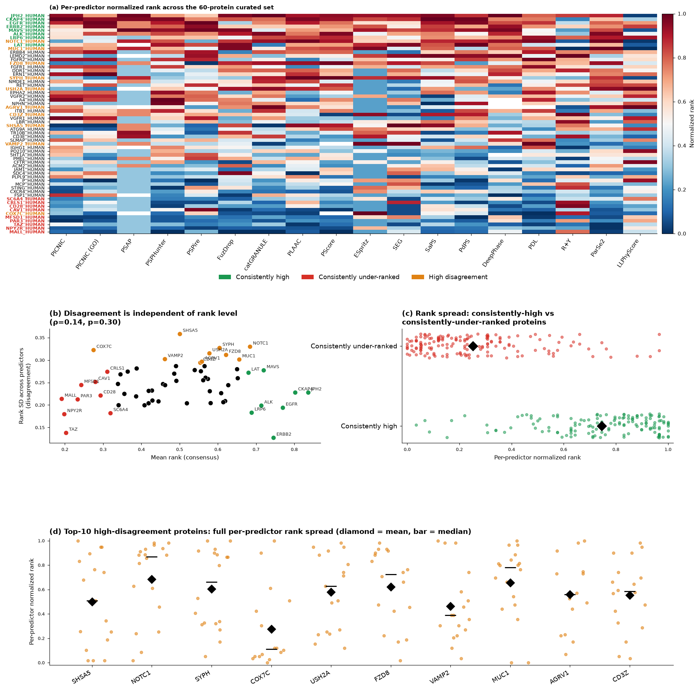

- **Classification** (Supplementary Table S3): using the plain mean rank and
  its cross-predictor SD, each of the 60 proteins was scored against three
  criteria — *rank-extreme-high* (top-10 by mean rank, restricted to those
  where ≥ 60% of the 18 predictors independently place it in their own top
  half), *rank-extreme-low* (bottom-10 by mean rank), and *high-disagreement*
  (top-10 by rank SD) — and assigned to a single primary group, with
  disagreement taking priority when a protein qualified for both a
  rank-extreme group and the disagreement group. Three proteins (NOTC1, MUC1
  — both rank-extreme-high; COX7C — rank-extreme-low) were reassigned this
  way and are reported under high-disagreement rather than their rank-extreme
  group below. This leaves n = 8 consistently-high, n = 9
  consistently-under-ranked, and n = 10 high-disagreement proteins.
- **Consistently high is a closed topological class**: all 8 are single-pass
  (JPH2, CKAP4, EGFR, ERBB2, MAVS, ALK, LRP6, LAT) — the same large
  RTK/receptor cohort identified in Section 3.
- **Consistently under-ranked is architecturally the mirror image**: 6/9 are
  multi-pass (MALL, NPY2R, PAR3, MFSD1, CRLS1, SC6A4), and the single-pass
  members of this group (TAZ, CAV1, CD28) are short or compact. The
  single-pass-vs-multi-pass split between the high and under-ranked groups is
  itself significant (Fisher's exact, p = 9.1 × 10⁻³) — topology class alone
  distinguishes the two extremes of the consensus, independent of the
  continuous TMD-count correlation already reported.
- **Disagreement is not explained by any measured feature.** Rank SD
  correlates with none of hydropathy, disorder fraction, LCR fraction, TMD
  count, length, charge, or PTM burden after FDR correction (all FDR > 0.2;
  Fig 8, panel-level tests in `output/group_feature_comparison_tests.csv`).
  High-disagreement proteins (e.g. SHSA5, NOTC1, SYPH, COX7C, USH2A, FZD8)
  span both topology classes and both rank extremes — disagreement appears to
  be tool-specific idiosyncrasy (e.g. a single predictor scoring a protein far
  outside the consensus) rather than a systematic gap the tools share.

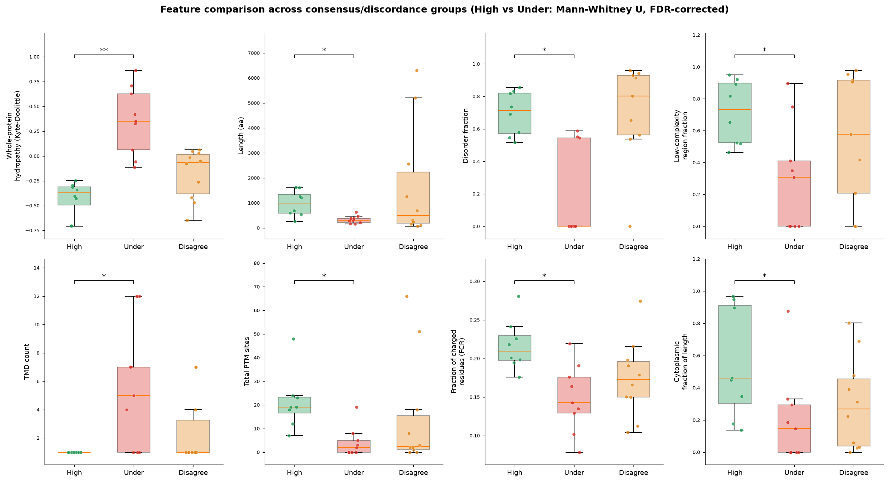

- **What separates high from under-ranked** (Mann-Whitney U, BH-FDR; Fig 8):
  whole-protein hydropathy (FDR = 1.3 × 10⁻³, more hydrophobic in the
  under-ranked group), fraction of charged residues (FDR = 1.3 × 10⁻²,
  higher in the high-ranked group), total PTM sites (FDR = 1.3 × 10⁻², higher
  in the high-ranked group), disordered fraction (FDR = 1.3 × 10⁻²),
  cytoplasmic PTM sites (FDR = 1.3 × 10⁻²), chain length (FDR = 1.5 × 10⁻²),
  TMD count (FDR = 1.8 × 10⁻²), LCR fraction (FDR = 2.7 × 10⁻²), net charge
  (FDR = 3.7 × 10⁻²), and cytoplasmic-domain fraction of the chain (FDR =
  3.7 × 10⁻²). This is the same soluble-IDR/architecture signature from Section 3,
  now shown to cleanly separate the two rank extremes rather than being only a
  continuous correlation.
- **Read**: there is no membrane-specific biological signal driving which
  proteins predictors miss — under-ranking tracks exactly the architectural
  axis (short, hydrophobic, multi-pass, few PTMs) already implicated as the
  generic soluble-IDR bias. Disagreement, in contrast, is unpredictable from
  any feature tested here and likely reflects individual-tool sensitivity to
  specific sequence motifs rather than a shared architectural blind spot.

## 5. Failure modes are architectural, not mechanistic

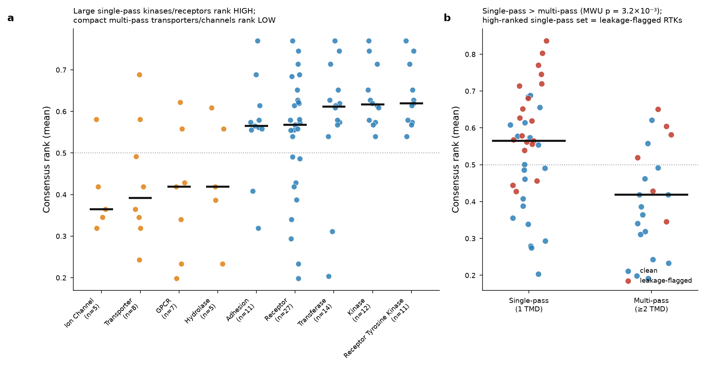

- Annotated all 60 with UniProt functional class, topology, and curated LLPS
  descriptors (driver/client role; autonomous vs partner-dependent mode);
  tested each vs **plain mean** consensus rank (MWU binary, Spearman continuous,
  Kruskal multi-level; all BH-FDR).
- **Significant — all architectural/functional**:
    - Chain length (Spearman): FDR = 1 × 10⁻⁴ (strongest).
    - Leakage-flagged **higher**: 0.58 vs 0.42 (FDR = 6 × 10⁻⁴).
    - Kinase higher: 0.62 vs 0.46 (FDR = 3 × 10⁻³).
    - RTK higher: 0.62 vs 0.46 (FDR = 4 × 10⁻³).
    - TMD count (Spearman, negative): FDR = 4 × 10⁻³.
    - **Single-pass > multi-pass**: 0.565 vs 0.419 (FDR = 8 × 10⁻³).
    - Transferase higher: 0.61 vs 0.46 (FDR = 0.035).
    - Monotone rise across classes: ion channel 0.36 / transporter 0.39 / GPCR
      0.42 → transferase 0.61 / kinase 0.62 / RTK 0.62.
- **Not significant — the mechanistic descriptors**: driver/client role
  (Kruskal FDR = 0.46); autonomous vs partner-dependent mode (FDR = 0.46).
- **Read**: predictors read architecture (size, membrane passes, hydrophobicity,
  enzyme class), **not** curated LLPS mechanism. They happen to rank the large
  single-pass RTKs correctly — because those look like soluble IDR proteins —
  but for compact or multi-pass proteins that condense via short cytoplasmic
  motifs, the same signature scores them near the floor regardless of the
  experimental evidence.

# Discussion (draft points)

- **Three recurring findings**:
    1. Best generalisers integrate AlphaFold structural features (PSPHunter,
       PSPire, PICNIC); a soluble-IDR biophysical model (LLPhyScore) collapses
       to chance → structural context carries the transferable signal.
    2. Given topology, 7/8 tools correctly localise signal to the cytoplasmic
       face and suppress the membrane core.
    3. Consensus is driven by the generic soluble-IDR signature —
       hydrophobicity (ρ = −0.69), length (+0.56), disorder (+0.33) — and by
       membrane architecture (TMD count −0.41), **not** by curated LLPS
       mechanism (driver/client role and autonomous/partner mode both
       non-significant). The tools rank large single-pass RTKs correctly only
       because those resemble soluble IDR proteins; compact and multi-pass
       proteins with genuine LLPS evidence are penalised for their membrane
       architecture.
- **Two general methodological points**:
    - Leakage direction matters: naïve membrane-background AUROCs *understate*
      the leaders because leaked proteins are mostly easy negatives; a per-tool,
      per-protein audit recovers the honest estimate.
    - Same-class background is essential; scoring vs a soluble proteome inflates
      accuracy by rewarding detection of "membrane-ness."
- **Practical recommendation**: score the **cytoplasmic domain in isolation**,
  not the full-length chain — TM (and, for most tools, extracellular) regions
  add noise, and full-length hydrophobicity dominates the consensus; the
  topology analysis shows the cytoplasmic face is where signal already
  concentrates. This is most consequential for compact and multi-pass proteins,
  whose short disordered motifs are swamped by membrane-embedded sequence.
- **For developers**: topology-aware training/evaluation — topology as an
  explicit feature, membrane-protein positives in training, same-class
  background reporting; do not let whole-chain hydrophobicity stand in as a
  negative LLPS signal for membrane proteins.
- **Consensus/discordance findings reinforce, rather than add to, the
  architecture story**: the consistently-high and consistently-under-ranked
  groups are cleanly separated by topology class alone (Fisher's exact
  p = 9.1 × 10⁻³) and by the same hydropathy/length/disorder/PTM axis already
  identified from the continuous correlations — there is no additional
  membrane-specific signal distinguishing "correctly ranked" from
  "systematically missed" proteins beyond generic architecture. Predictor
  *disagreement*, by contrast, is not explained by any feature tested here and
  is likely driven by individual-tool sensitivities rather than a shared
  architectural blind spot — a negative result worth reporting so future work
  does not assume disagreement is informative about biology.
- **The region-level score comparison now cleanly separates topology
  biology from the concatenation artefact**, across all 14 region-capable
  predictors including both structure-based tools (PICNIC, PSPire), whose
  structural analogue of sequence concatenation — a single continuous
  chain built from renumbered, coordinate-preserving AlphaFold fragments —
  was newly built and scored this round. The topology-class effect
  (cytoplasmic > TM) reproduces the coarser Fig 2b pattern and is
  unaffected by whether a region is queried as one concatenated
  sequence/structure or as separate fragments, so it is not an artefact
  of the region-scoring shortcuts. The concatenation artefact itself is
  real but tool- and region-specific, not a uniform correction factor;
  it is largest for the two structure-based tools scored on disjoint TM
  helices, a caveat future structural-region analyses should account for
  rather than treat pdb_concatenated and pdb_region scores as
  interchangeable.
- **Limitations**: 60 curated positives; annotation-based topology; consensus is
  in-sample. Coiled-coil features (relevant to SNARE-family and receptor-tail
  proteins in the curated set) were not computed here and remain the clearest
  follow-up. But the leakage-corrected benchmark, topology analysis, and
  feature-resolved consensus — now including the consistently-high /
  under-ranked group classification — converge on the same failure mode:
  predictors reward the soluble-IDR signature and penalise membrane
  architecture, independent of experimental mechanism.

# Methods

**Protein set.** Sixty human membrane proteins with curated experimental LLPS
evidence were assembled, 56 from PhaSepDB and the remainder from LLPSDB
[@phasepdb2020; @llpsdb2020]. Each was annotated with UniProt membrane topology
(single- vs multi-pass; TM-domain count), chain length, functional class, and
the source database's curated LLPS descriptors (driver/client role; autonomous
vs partner-dependent mode; in-vitro and in-vivo evidence flags)
[@uniprot2023]. The set comprised 39 single-pass and 21 multi-pass proteins.

**Predictors.** Eighteen predictor scores were computed or collated: PICNIC and
PICNIC (GO) [@picnic2024], PSPire [@pspire2024], PSPHunter [@psphunter2024],
PSAP [@psap2021], PhaSePred's SaPS and PdPS sub-scores [@phasepred2022], PDL
[@pdl2025], FuzDrop [@fuzdrop2020], catGRANULE [@catgranule2016], PLAAC
[@plaac2014], PScore and its residue-composition baseline (R+Y) [@vernon2018],
ParSe 2.0 [@parse2_2023], LLPhyScore [@llphyscore2022], PSAP-independent
DeePhase [@deephase2021], the ESpritz disorder proxy [@espritz2012], and the
SEG low-complexity masker [@seg1993]. Structure-based tools (PICNIC, PICNIC
(GO), PSPire) used per-residue AlphaFold2 models [@alphafold2021]; disorder was
computed with IUPred2A where required [@iupred2a2018].

**Benchmarking.** Discrimination was quantified by AUROC against a background of
other human membrane proteins (membrane-vs-membrane), with additional
backgrounds (whole proteome, single-pass-only, multi-pass-only) reported in the
supplement. 95% confidence intervals were obtained by bootstrap. Maximum
Matthews correlation coefficient (MaxMCC) was recorded as a threshold-free
secondary metric. Training-set leakage was audited by matching each of the 60
positives (and each background protein) against every tool's published training
set; per-tool AUROCs were recomputed on the leakage-free subset ("clean").

**Topology-resolved scoring.** For tools producing per-residue or per-region
output, scores were partitioned into cytoplasmic, transmembrane, and
extracellular/lumenal regions using UniProt topology. Each region's score was
compared against the whole-protein score (paired Wilcoxon signed-rank), and
cytoplasmic regions were contrasted directly against TM regions. Because raw
score ranges differ by orders of magnitude across tools, the summary in
**Figure 2b** uses the scale-free fraction of proteins with cytoplasmic > TM
score. All p-values were Benjamini–Hochberg FDR-corrected across tools.

**Consensus.** Each tool's raw score was converted to a normalised per-protein
rank across the 60 proteins (0 = lowest, 1 = highest predicted propensity;
LLPhyScore sign-flipped before ranking so that higher always means more
LLPS-prone). The headline consensus is the **plain mean** normalised rank across
the 18 tools; an AUROC-weighted mean (weights = leakage-corrected
membrane-vs-membrane AUROC) is reported as a supplement and agrees closely
(ρ = 0.996, identical top/bottom proteins). Between-predictor standard deviation
gives a per-protein disagreement score. The full 60 × 18 rank matrix is provided
as Supplementary Table S1 (`output/rank_consensus_matrix.csv`). Associations
between consensus rank and sequence features / annotations were tested with
Spearman correlation (continuous), Mann–Whitney U (binary), and Kruskal–Wallis
(multi-level), all BH-FDR corrected. Sequence features (Kyte–Doolittle
hydropathy, charge descriptors via localCIDER, disordered fraction from ESpritz,
low-complexity fraction from SEG) were computed on whole-protein and
cytoplasmic-only sequences. Post-translational modification burden was pulled
per protein from the UniProtKB REST API [@uniprot2023] (feature types:
Modified residue, Cross-link, Glycosylation, Lipidation), counted both across
the whole sequence
and restricted to residues falling within annotated cytoplasmic topological
domains (same topology boundaries used for the region-based score analysis in
Figure 2).

**Consensus/discordance classification.** Proteins were assigned to three
non-exclusive groups from the plain mean rank and its cross-predictor SD
(Figure 7; `output/consensus_discordance_groups.csv`): *consistently high*
(top 10 by mean rank, further requiring that ≥ 60% of the 18 predictors
independently place the protein in their own top half — i.e. broad agreement,
not one or two outlier tools driving the average), *consistently
under-ranked* (bottom 10 by mean rank), and *high-disagreement* (top 10 by
rank SD). Features (whole-protein hydropathy, chain length, disordered
fraction, LCR fraction, TMD count, TM/cytoplasmic/extracellular length
fraction, charge descriptors, and PTM burden) were compared between the
consistently-high and consistently-under-ranked groups by Mann-Whitney U,
BH-FDR corrected across features (Figure 8; `output/
group_feature_comparison_tests.csv`); topology class (single- vs multi-pass)
was compared by Fisher's exact test. The same feature set was correlated
against rank SD (Spearman, BH-FDR corrected) across all 60 proteins to test
for disagreement drivers.

**Region-level score comparison: separating topology biology from the
concatenation artefact.** The topology-resolved scoring pipeline (`output/
topology_scoring_pipeline.md`) was extended to a single unified table
(Supplementary Table S2; `output/predictor_region_score_comparison_wide.csv`)
reporting, per protein, predictor, and topology region (cytoplasmic / TM /
extracellular-lumenal), three quantities: the *unspliced* score (mean of the
tool's per-segment scores, each contiguous topological span scored
individually), the *spliced* score (all segments of a region joined into one
query and scored once), and the whole-protein score. Twelve of the 14
region-capable tools (catGRANULE, PLAAC, PScore, ESpritz, SEG, ParSe2,
LLPhyScore, PSPsPredict, PSAP, FuzDrop, DeePhase, PSPHunter) are
sequence-based; their spliced score is the concatenated-sequence score, and
for the five per-residue tools among them (catGRANULE, PLAAC, PScore,
ESpritz, SEG) the concatenated/segment scores are derived by slicing the
full-protein per-residue score array rather than re-scoring isolated
fragments. FuzDrop and ParSe2 additionally require the espritz/backbone
sequence to satisfy a tool-intrinsic minimum length (ParSe2: 25 aa; FuzDrop's
disorder-window requirement has a similar practical floor), so per-segment
coverage is reduced specifically for the shortest topology spans — almost
entirely single-pass Transmembrane segments (median 21 aa; `output/
predictor_coverage_summary.csv`) — rather than a pipeline defect.

The two remaining tools, PICNIC and PSPire, are structure/AlphaFold2-based
and have no isolated-sequence mode. Their unspliced score is the mean of
per-fragment scores computed directly on structural fragments extracted from
the full-length AlphaFold model for each topology region (`pdb_region`, via
`build_segment_pdbs.py` / `integrate_pdb_segments.py`). Their spliced score
(`pdb_concatenated`) is the structural analogue of sequence concatenation:
each region's (possibly disjoint) AlphaFold-model fragments are renumbered
into one continuous chain 1..N while keeping the true 3D coordinates
unchanged (`build_concatenated_pdbs.py`), then scored as a single structure
(`run_picnic_pdb_concatenated.py`, `run_pspire_pdb_concatenated.py`). This
mirrors, at the structural level, exactly what sequence concatenation does at
the sequence level, allowing the same spliced-vs-unspliced test to be applied
uniformly to all 14 tools.

Two orthogonal statistical tests were then run on this table.
(1) **Topology-class (biology) effect** (`output/
predictor_region_biology_tests.csv`): for each tool, paired Wilcoxon tests
contrast unspliced (segment-mean) scores between each pair of topology
regions (Cytoplasmic vs TM, Cytoplasmic vs Extracellular/Lumenal, TM vs
Extracellular/Lumenal), BH-FDR corrected within tool. Using only unspliced
scores means this test cannot be confounded by the concatenation artefact.
(2) **Slicing/splicing (methodological) artefact** (`output/
predictor_splice_artifact_tests.csv`): for each tool and region, a paired
Wilcoxon test contrasts the spliced score against the unspliced score for
the same region, BH-FDR corrected within tool. This isolates whether
concatenating a region's fragments into one query changes the score,
independent of which topology region is involved. Coverage for both tests is
tabulated in `output/predictor_coverage_summary.csv` and visualised together
in Figure 9.

**Reproducibility.** All scores, statistical tests, and figures are regenerated
by the analysis scripts in the accompanying repository; every quantitative claim
in this manuscript is drawn from a single machine-readable results digest
(`output/results_digest.json`).

# Figure legends

**Figure 1. Structure-aware predictors lead the membrane-vs-membrane benchmark
and training-set leakage is asymmetric.** Left: full-set (grey) and per-tool
leakage-free ("clean", red) AUROC for 18 predictors discriminating 60 membrane
LLPS proteins from a background of other human membrane proteins; error bars are
95% bootstrap CIs, and *n* is the leakage-free positive count. Label colour
encodes predictor mechanism. Right: change in AUROC after leakage removal
(green = rises, red = drops). Removing leaked proteins raises the structure-based
leaders (PSPHunter +0.10, PdPS +0.05, PSPire +0.05) because their leaked
proteins are predominantly background negatives, and lowers PDL (−0.08), whose
leaked proteins are positives.

**Figure 2. Predictor scores follow the membrane topology.** (a) Per-region
minus whole-protein score for the two AlphaFold-based structure tools, PICNIC
and PSPire, across cytoplasmic, transmembrane, and extracellular/lumenal
regions; cytoplasmic regions score above and TM regions below the whole-protein
baseline (paired Wilcoxon, *** FDR < 0.001, n.s. not significant). (b) Fraction
of proteins scoring cytoplasmic > TM for eight position-aware tools; seven of
eight exceed 50% (all FDR < 0.05), and only SEG, a low-complexity masker,
reverses.

**Figure 3. A cross-predictor consensus for 60 membrane LLPS proteins.** Plain
mean normalised rank (x, higher = consistently predicted phase-separation-prone)
versus between-predictor standard deviation (y, higher = more disagreement).
Point colour/marker encodes single- vs multi-pass topology; shaded bands mark
consistently high (>0.7) and low (<0.3) rank. Large single-pass receptors and
RTKs with long disordered cytoplasmic tails (EGFR, ERBB2, JPH2, CKAP4, MAVS)
populate the high-consensus region; compact and multi-pass transporters,
channels and small tail-anchored proteins (MALL, NPY2R, MFSD1, PAR3, COX7C,
TAZ) populate the low-consensus region. Rank and disagreement are uncorrelated
(ρ = −0.13), so both extremes reflect predictor agreement.

**Figure 5. The consensus is driven by the generic soluble-IDR sequence
signature.** (a) Spearman correlation of each sequence/architecture/PTM feature
with consensus rank (* FDR < 0.05); whole-protein hydrophobicity is the
strongest (negative) correlate, followed by positive length, total and
cyto-tail PTM-site, LCR and disorder terms, and negative TM-fraction /
TMD-count / net-charge terms. (b) Consensus rank vs Kyte–Doolittle hydropathy
(ρ = −0.69): more hydrophobic proteins rank lower, across both topology
classes. (c) Rank vs disordered fraction (ρ = +0.33), (d) vs log chain length
(ρ = +0.56), and (e) vs total annotated UniProt post-translational
modification sites (ρ = +0.49). Points coloured by topology; extreme proteins
labelled.

**Figure 2b (supporting Figure 3). Leading predictors penalise multi-pass
architecture in their raw scores.** Raw score of each of the four leading tools
(PSPHunter, PSPire, PdPS, FuzDrop) versus transmembrane-domain count for the 60
proteins; black line = binned median. Raw scores fall with increasing TMD count
for all four (Spearman ρ = −0.47, −0.43, −0.44, −0.31; all p < 0.02), confirming
that the architecture bias in the consensus is present in the individual tools
and not introduced by rank-averaging.

**Figure 4. The consensus tracks architecture and function, not curated LLPS
mechanism.** (a) Mean consensus rank by UniProt functional class (median bars);
rank rises from compact multi-pass ion channels, transporters and GPCRs at the
bottom to large single-pass transferases, kinases and receptor tyrosine kinases
at the top. (b) Consensus rank for single- vs multi-pass proteins, coloured by
leakage status; single-pass proteins rank higher (MWU p = 3.2 × 10⁻³), and the
high-ranked single-pass set is enriched for leakage-flagged receptors.

**Figure 7. Consensus and discordance classification of the 60 curated
proteins.** (a) Per-predictor normalised rank (1 = highest-scored by that
predictor) for all 60 proteins (rows, sorted by mean rank) across all 18
predictors (columns); row labels coloured/bolded by group membership
(green = consistently high, red = consistently under-ranked, orange = high
disagreement). (b) Mean rank vs between-predictor rank SD; the two are
uncorrelated (ρ = 0.14, p = 0.30), confirming that disagreement is not
concentrated at either rank extreme. (c) Per-predictor rank distribution
(jittered strip, diamond = group mean) contrasting the consistently-high and
consistently-under-ranked groups — the two populations are almost
non-overlapping. (d) Per-predictor rank spread for the ten highest-SD
proteins, showing that disagreement typically arises from one or two outlier
predictors against an otherwise consistent field, not a uniformly split vote.

**Figure 8. Sequence and architectural features separating consistently-high,
consistently-under-ranked, and high-disagreement proteins.** Boxplots (points
jittered) of the eight features surviving BH-FDR correction between the
consistently-high and consistently-under-ranked groups (Mann-Whitney U,
significance bars annotated): whole-protein hydropathy, chain length,
disordered fraction, low-complexity-region fraction, TMD count, total PTM
sites, fraction of charged residues, and cytoplasmic-domain length fraction.
The high-disagreement group (orange) is shown alongside for reference but was
not found to differ significantly from either extreme on any tested feature
(Supplementary Table S4).

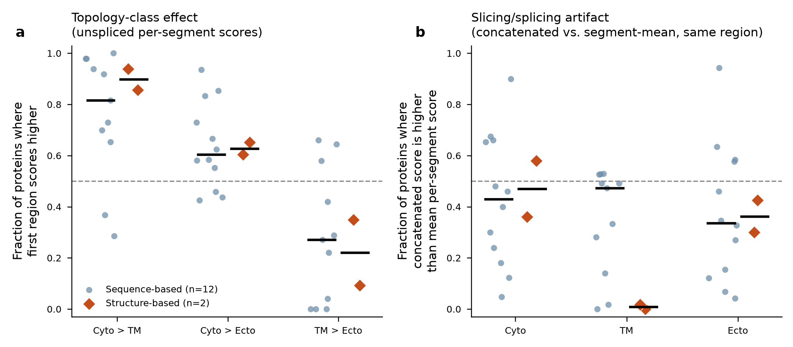

**Figure 9. Topology-class biology and the slicing/splicing artefact,
separated, across all 14 region-capable predictors.** Each point is one
predictor (circle = sequence-based, n = 12; diamond = structure-based,
PICNIC/PSPire, n = 2); horizontal bars mark the group median. **(a)**
Topology-class effect: fraction of proteins for which the first-named region
scores higher than the second, using only unspliced (per-segment-mean)
scores, for the three pairwise region contrasts. Cytoplasmic scores exceed
TM for nearly every tool, including both structure-based tools; the
TM-vs-extracellular/lumenal contrast is weaker and mixed in direction across
tools. **(b)** Slicing/splicing artefact: fraction of proteins for which the
spliced (single-query concatenated sequence, or renumbered
coordinate-preserving concatenated structure for PICNIC/PSPire) score
exceeds the unspliced (segment-mean) score, for the same region. Medians
cluster near 0.5 for most sequence-based tools, but PICNIC and PSPire both
show a near-complete, tool-consistent score drop specifically for
concatenated Transmembrane structures (concatenated score higher in 0/56 and
1/56 proteins respectively), a topology-specific effect not present in their
cytoplasmic or extracellular/lumenal splicing tests. Full statistics in
`output/predictor_region_biology_tests.csv` and `output/
predictor_splice_artifact_tests.csv`.

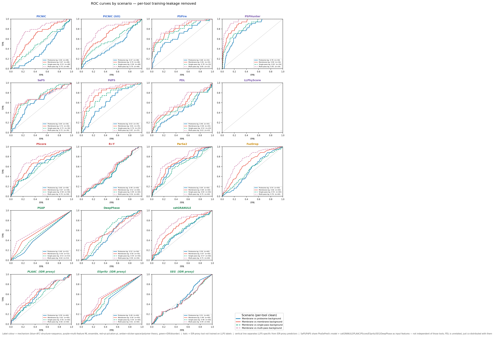

**Supplementary Figure S1. ROC curves across background scenarios.** Full ROC
curves for the leading predictors under the four background definitions
(membrane-vs-membrane, vs multi-pass, vs single-pass, vs whole proteome).

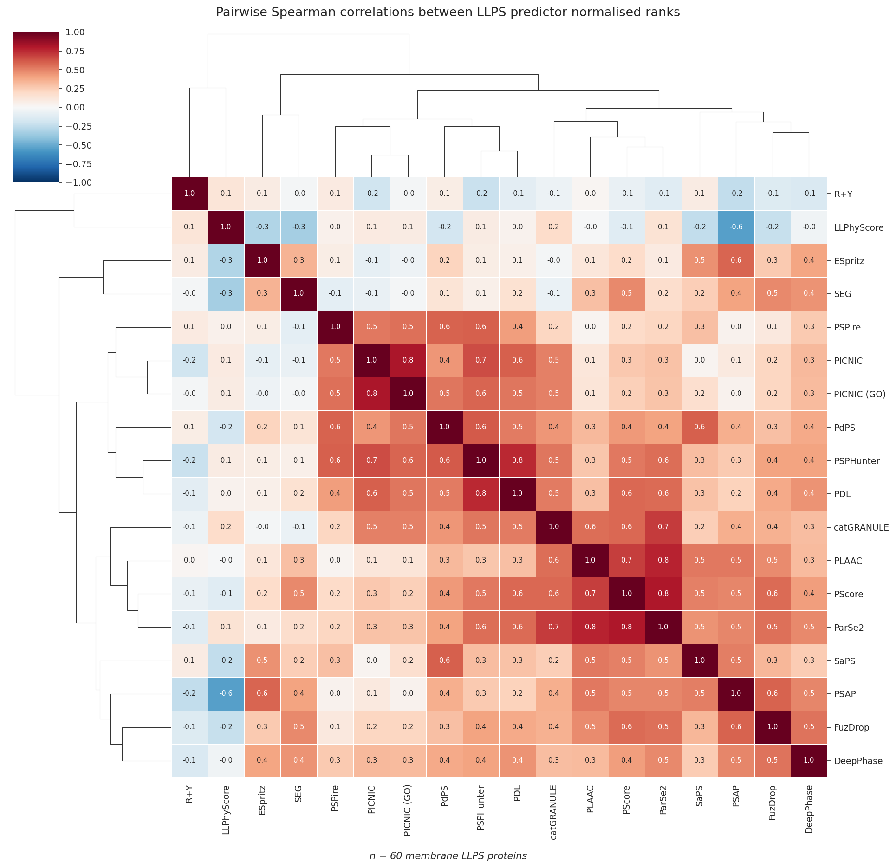

**Supplementary Figure S2. Cross-predictor score correlation.** Spearman
correlation matrix of the 18 predictor scores across the 60 proteins,
illustrating which tools share underlying signal (e.g. the PhaSePred-derived
sub-scores and the IDR proxies).

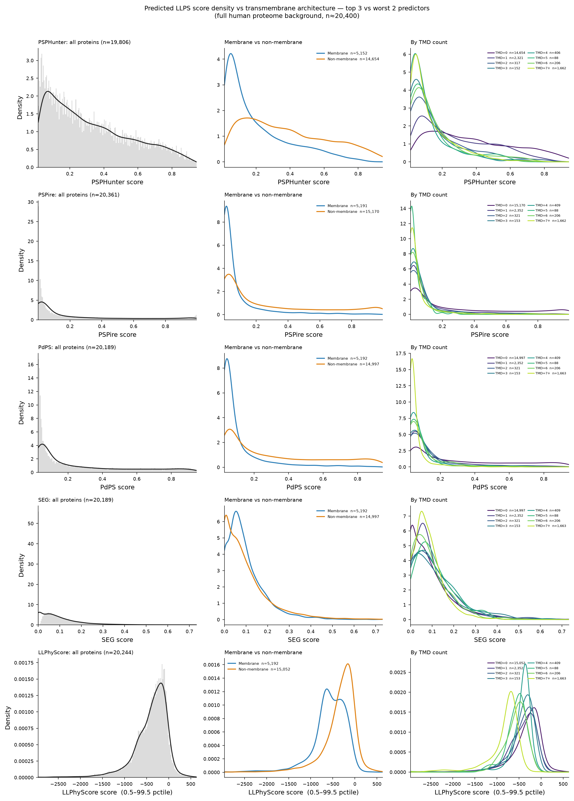

**Supplementary Figure S3. The membrane-architecture bias is a proteome-wide
property of the leading predictors, not an artifact of the curated 60-protein
set.** Score density (histogram + KDE, left column), membrane-vs-non-membrane
score distributions (centre column), and score distributions stratified by
TMD count (right column, viridis) for the three leading predictors
(PSPHunter, PSPire, PdPS) and the two worst-performing predictors (SEG,
LLPhyScore) by leakage-corrected membrane-vs-membrane AUROC, computed across
the full human proteome background (`output/background_scored.csv`,
n ≈ 20,400). LLPhyScore's unbounded linear-sum score is shown clipped to its
0.5–99.5th percentile range (see Methods) because its raw range spans
approximately −19,600 to +10,300 and is otherwise dominated by extreme
outliers. Proteome-wide, PSPHunter, PSPire, PdPS and LLPhyScore all show
significant negative score-vs-TMD-count correlation (Spearman ρ = −0.35 to
−0.41, all p < 10⁻⁵ ) and membrane proteins score significantly lower than
non-membrane proteins (Mann–Whitney p < 10⁻⁷ for all four); SEG alone shows
negligible architecture dependence (ρ = +0.04) — consistent with its lone
reversal in the cytoplasmic-vs-TM topology test (Figure 2b) and its
chance-level discrimination in the ROC benchmark (Figure 1).

# References
